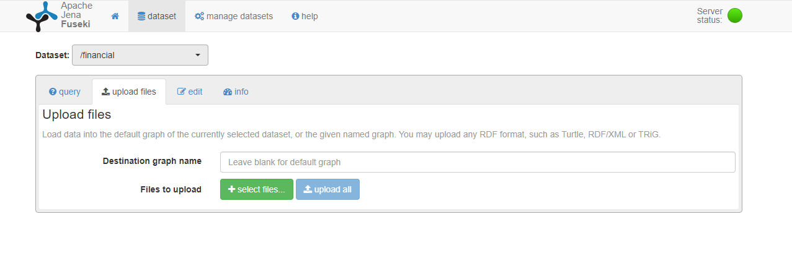

# Financial News Semantic Scraper
This is a open source project that let users to navigate through semantics of financial news and build a knowledge graph.

- Graph visualization is supported by [tarsier](https://github.com/desmovalvo/tarsier/tree/master).

- Graph storage is provided by [apache jena fuseki](https://jena.apache.org/index.html).

- Inference is made by our own and is based on a set of meaningful sparql queries (you can trust in us or do it better).

## Installation guide

Before you starts the installation steps is recommended to download or clone this project. 

### Apache Jena Fuseki installation and configuration

1. Download fuseki [here](https://jena.apache.org/download/index.cgi)

2. Run jar file "fuseki-server.jar"

3. Go to default [fuseki interface](http://localhost:3030).

4. Click on "manage dataset" and add a new dataset with name "financial" and "Persistent" Dataset type.

5. At the end you must see the following web interface as home page:

N.B. please notice that is provided instruction only with default paramenters. You can modify all the settings you want but pay attention on what else you have to modify in the software. (In further release we will provide and support fully customizaton)

### Load base ontology

1. Go to fuseki home page.

2. Click on "datasets" in top menu and set "/financial" dataset.

3. Click on "upload files".
If you followed correctly the steps you must see the following page:

4. Leave default graph and click on "select files"

5. Select in the project directory "{project_dir}/resources/ontologies/FinancialNewsOntology_beta3.owl" file.

6. Click on "upload now".

All done with fuseki and ontology configuration. You can relax now!

## Start the software

## Use the software for financial analysis

### Use case: Invest in ETF

### Use case: Invest in obligations

### Use case: Invest in Stocks

